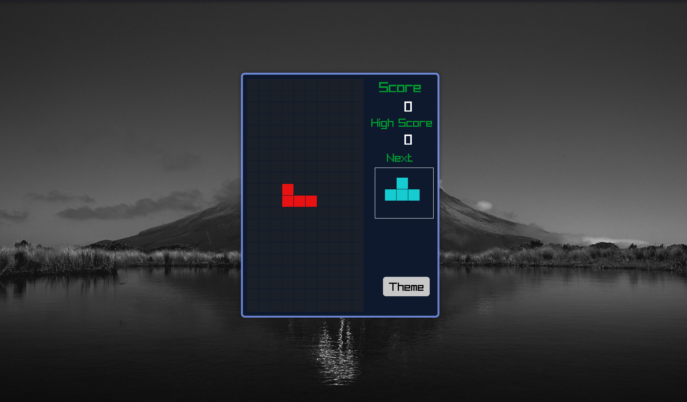
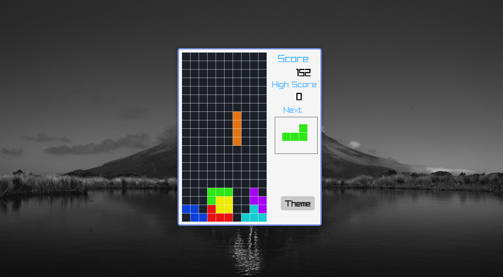

# Tetris на C++ 🎮


**Классическая игра Тетрис**, реализованная на C++ с использованием библиотеки **raylib**. Наслаждайтесь игрой с современными эффектами, звуками и сменой тем! 🎉

---

## 🛠 Особенности
- **Классический геймплей**: Механика Тетриса с реалистичной физикой.
- **Настраиваемые темы**: Переключайтесь между светлой и тёмной темами.
- **Звуковые эффекты и музыка**: Воспоминания о ретро-игре с современными звуками.
- **Трекер рекордов**: Соревнуйтесь с собой, побеждая свой рекорд!

---

## 📂 Структура проекта
```
.
├── Font               # Шрифты, используемые в игре
│   └── monogram.ttf
├── lib                # Необходимые библиотеки
│   ├── libgcc_s_dw2-1.dll
│   └── libstdc++-6.dll
├── Makefile           # Конфигурация сборки
├── Sounds             # Звуковые эффекты и музыка
│   ├── clear.mp3
│   ├── music.mp3
│   └── rotate.mp3
└── src                # Исходный код
    ├── block.cpp
    ├── colors.cpp
    ├── game.cpp
    ├── grid.cpp
    ├── main.cpp
    ├── utils.h
```

---

## 🎮 Как играть

1. **Запуск игры**: Запустите исполняемый файл и нажмите `ПРОБЕЛ`, чтобы начать.
2. **Управление**:
   - `⬅️` и `➡️`: Движение блоков влево и вправо.
   - `⬆️`: Поворот блока.
   - `⬇️`: Ускорение падения блока.
   - `P`: Пауза/Возобновление игры.
3. **Цель игры**: Заполните ряды полностью, чтобы они исчезли. Игра ускоряется с увеличением вашего счёта.

---

## 🚀 Как собрать и запустить

### Требования
- **Компилятор C++**: Убедитесь, что у вас установлен `g++`.
- **raylib**: Установите библиотеку raylib. На Linux:
  ```bash
  sudo apt install libraylib-dev
  ```

### Инструкция по сборке
1. Склонируйте репозиторий:
   ```bash
   git clone https://github.com/0sokrat0/Tetris-C-.git
   cd Tetris-C-
   ```
2. Соберите проект:
   ```bash
   make
   ```
3. Запустите игру:
   ```bash
   ./game
   ```

---

## 🖼 Скриншоты




---

## 🎥 Видео-демонстрация

Скачайте и посмотрите [видео](img/TetrisC++.mp4) с демонстрацией геймплея.

---

## 🤝 Как помочь проекту

Мы приветствуем ваши идеи и улучшения! 🎉 Если хотите помочь:
- Форкните репозиторий.
- Создайте новую ветку.
- Отправьте Pull Request.

---

## ⚙️ Технические детали
- **Язык**: C++ (Стандарт: C++14)
- **Библиотека**: raylib
- **Платформы**: Windows, Linux, macOS

---

## 📜 Лицензия

Проект распространяется под лицензией [MIT License](LICENSE).

---

## 🌟 Благодарности

Особая благодарность:
- Команде [raylib](https://www.raylib.com/) за их невероятную библиотеку.
- Сообществу любителей Тетриса за вдохновение.

---

**🎉 Удачи в игре и наслаждайтесь процессом!**

[](https://github.com/0sokrat0/Tetris-C-)
```